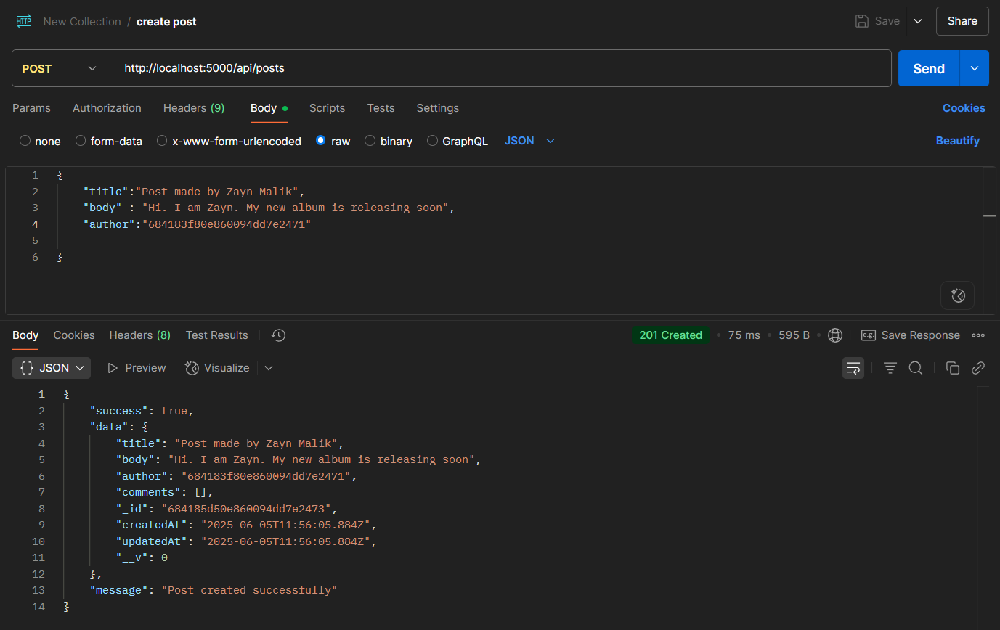
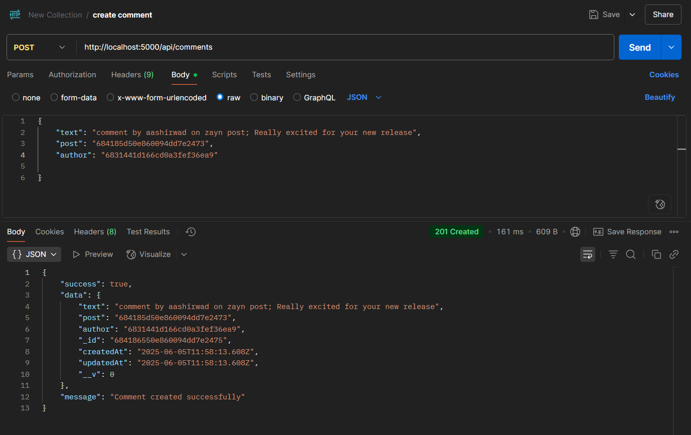
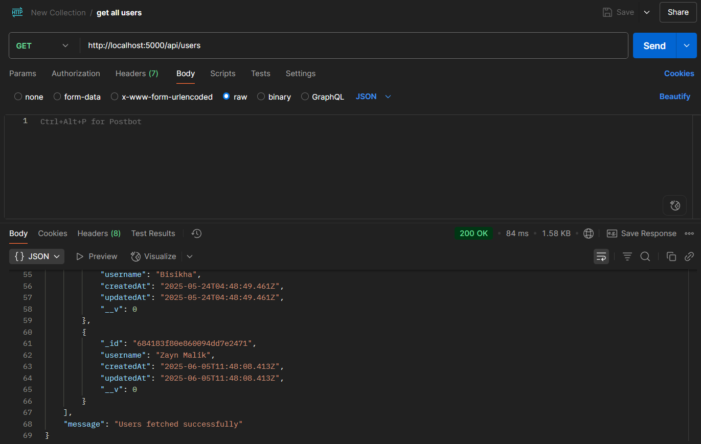
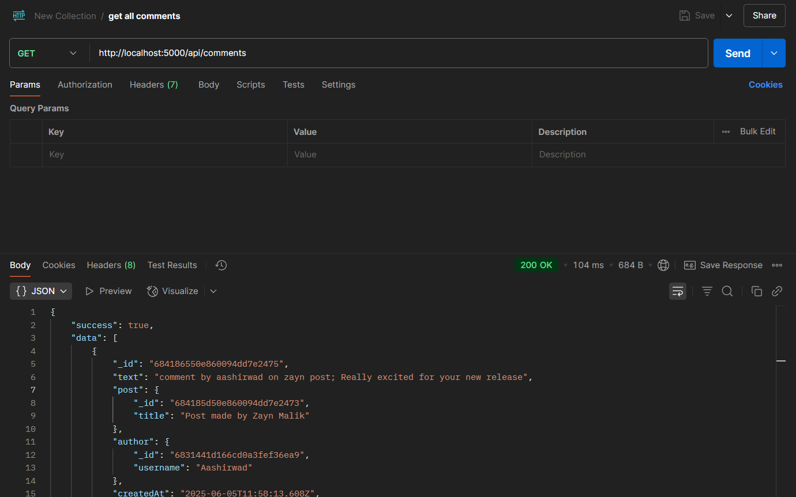

📝 Blog API

A simple and beginner-friendly Blog API built with **Node.js**, **Express**, and **MongoDB** using **Mongoose**.


## 🚀 Features

- ✅ Create, Read, Update, and Delete Blog items
- 🧱 RESTful API structure
- 📦 MongoDB integration using Mongoose
- 🧪 Tested with Postman
- 🌱 Beginner-friendly and clean codebase

## 🛠️ Tech Stack

- Node.js
- Express.js
- MongoDB
- Mongoose
- dotenv

## 📮 API Endpoints

| Method | Route             | Description                              |
|--------|-------------------|------------------------------------------|
| POST   | `/api/users`      | Create a user                            |
| POST   | `/api/posts`      | Create a post                            |
| POST   | `/api/comments`   | Create a comment                         |
| GET    | `/api/users`      | Get all users                            |
| GET    | `/api/posts`      | Get all posts                            |
| GET    | `/api/posts/:id`  | Get a get single post with all comments  |
| GET    | `/api/comments`   | Get all comments                         |
| PUT    | `/api/posts/:id`  | Update post                              |
| DELETE | `/api/posts/:id`  | Delete post and comments                 |

## 🔧 Setup Instructions

1. **Clone the repository**

    ```
    git clone https://github.com/Aashirwad10/Blog-api
    cd Blog-api
    ```
    
2. **Install dependencies**

    ```
    npm install
    ```

3. **Create `.env` file**

    - Create a `.env` file in the root folder
    - Add your MongoDB URI like this:

      ```
      MONGO_URI= mongodb+srv://abcdefghijklmnopqrstuvwxyz
      ```

4. **Run the server**

    ```
    npm run dev
    ```

Server runs on `http://localhost:5000` (or your specified port)

## 📸 API Examples
    
Here are some example requests and responses using Postman to demonstrate how the API works:

1. **POST Create a user**
    - `http://localhost:5000/api/users`  

    

2. **POST Create a post**
    - `http://localhost:5000/api/posts`  

    

3. **POST Create a comment**
    - `http://localhost:5000/api/comments`  

    

4. **GET Get all users**
    - `http://localhost:5000/api/users`  

    

5. **GET Get all posts**
    - `http://localhost:5000/api/posts`  

    

6. **GET Get a get single post with all comments**
    - `http://localhost:5000/api/posts/684185d50e860094dd7e2473`  

    

7. **GET Get all comments**
    - `http://localhost:5000/api/posts/684185d50e860094dd7e2473`  

    

8. **Put Update post**
    - `http://localhost:5000/api/posts/684185d50e860094dd7e2473`  

    

9. **DELETE Delete post and its related comment**
    - `http://localhost:5000/api/posts/684185d50e860094dd7e2473`  

    

---

## 🙋‍♂️ About Me

This is a beginner-level project built as part of my learning journey in backend development.  
I'm currently focused on building simple APIs, interacting with databases (MongoDB), and testing everything using Postman.  
There’s just a little basic frontend for now.

If you'd like to suggest improvements or just say hi, feel free to reach out:

- 📧 Email: backend.aashirwad@gmail.com  
- 📱 Instagram or Facebook: Linked in my GitHub profile bio

Thanks for checking out the project! 🙇‍♂️

Made with ❤️ while learning backend development.

